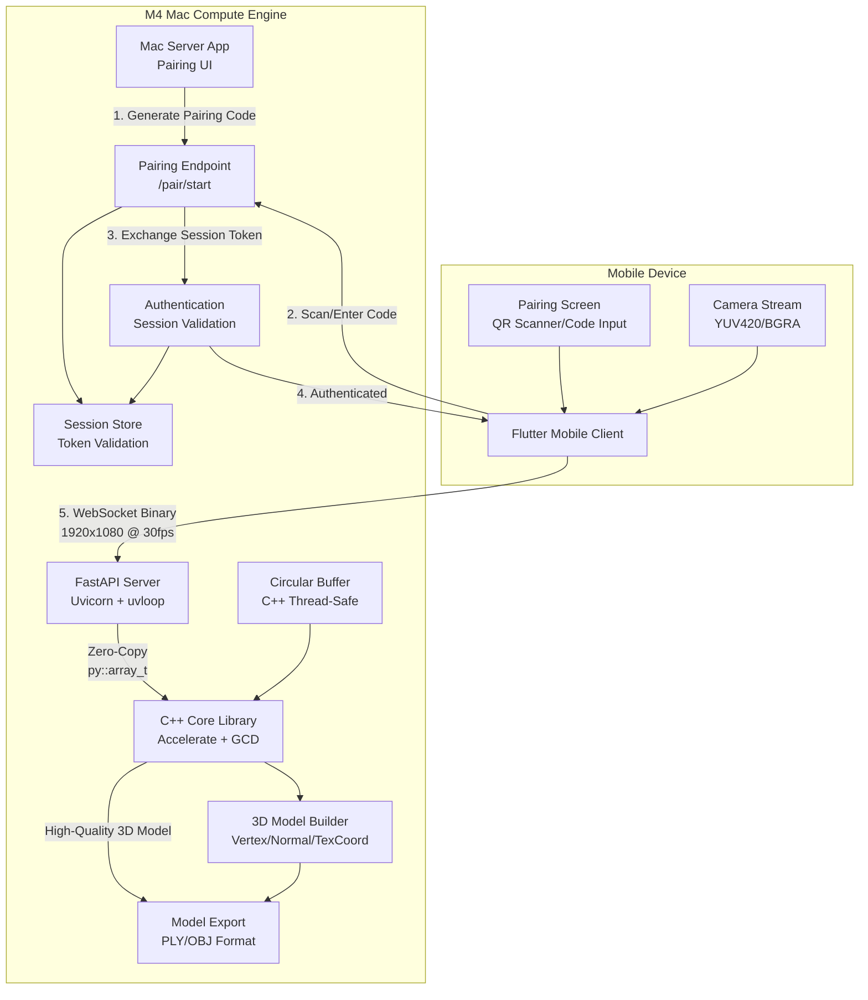

# 3D Reconstruction Pipeline - High-Performance Infrastructure

## Architecture Overview

The system consists of three main components with a secure pairing workflow before data transmission:

## Implementation Plan

### 1. C++ Core Library (`forge_engine`)

**Files to create:**

- `cpp/CMakeLists.txt` - Build configuration with M4 optimizations
- `cpp/include/forge_engine/FrameProcessor.hpp` - Main processing class
- `cpp/src/FrameProcessor.cpp` - Implementation with Accelerate/GCD
- `cpp/src/pybind_module.cpp` - Pybind11 bindings with zero-copy arrays
- `cpp/include/forge_engine/CircularBuffer.hpp` - Thread-safe circular buffer
- `cpp/include/forge_engine/Model3D.hpp` - 3D model data structure
- `cpp/src/Model3D.cpp` - Model builder and export functionality

**Key features:**

- Use `Accelerate.framework` for matrix operations (vDSP, BLAS)
- Grand Central Dispatch (GCD) queues for parallel frame processing
- `py::array_t<uint8_t>` for zero-copy Python ↔ C++ data transfer
- Circular buffer to decouple network I/O from processing
- M4-specific compiler flags: `-march=armv8.5-a` or `-mcpu=apple-m4`
- Placeholder `processFrame()` method for reconstruction algorithm
- High-quality 3D model builder with vertex, normal, and texture coordinate support
- Export functionality for PLY (binary/ASCII) and OBJ formats
- Progressive model refinement as frames are processed

### 2. FastAPI Server

**Files to create:**

- `server/main.py` - FastAPI app with WebSocket binary handler
- `server/pairing.py` - Device pairing and session management
- `server/requirements.txt` - Dependencies (fastapi, uvicorn[standard], uvloop, pybind11, numpy, qrcode[pil])
- `server/__init__.py` - Package marker

**Key features:**

- **Device Pairing Workflow:**
- `POST /pair/start` - Mac generates 6-digit pairing code + QR code, returns code and session token
- `POST /pair/verify` - Mobile device submits pairing code, receives session token if valid
- Pairing codes expire after 5 minutes
- Session tokens required for WebSocket connection
- **WebSocket Security:**
- WebSocket endpoint validates session token before accepting connection
- Only authenticated devices can stream frames
- Rejects connections without valid session token
- **WebSocket Binary Handler:**
- Accepts raw binary `bytes` (not Base64) only after authentication
- Uvicorn with `uvloop` for high-performance event loop
- Direct `uint8_t*` pointer passing to C++ via pybind11
- Frame queue management to prevent blocking
- **REST Endpoints:**
- Model export (GET `/export/ply`, `/export/obj`) - requires session token
- Real-time model status (GET `/model/status`) - requires session token
- Health check (GET `/health`) - public endpoint

### 3. Flutter Mobile Client

**Files to create:**

- `mobile/lib/main.dart` - Main app with pairing flow and camera setup
- `mobile/lib/screens/pairing_screen.dart` - Pairing UI with QR scanner and manual code entry
- `mobile/lib/services/pairing_service.dart` - Pairing API client
- `mobile/lib/services/session_manager.dart` - Session token storage and management
- `mobile/lib/isolates/camera_stream_isolate.dart` - Separate isolate for WebSocket streaming
- `mobile/lib/services/websocket_service.dart` - WebSocket binary communication with session token
- `mobile/pubspec.yaml` - Dependencies (camera, web_socket_channel, qr_code_scanner, http, shared_preferences)

**Key features:**

- **Device Pairing:**
- Initial pairing screen on app launch
- QR code scanner to read pairing code from Mac display
- Manual code entry fallback (6-digit code)
- Session token stored securely (SharedPreferences)
- Auto-reconnect with stored session token if available
- **Camera Streaming:**
- `camera` package with `ImageFormatGroup.yuv420` (Android) / `bgra8888` (iOS)
- Fixed 1920x1080 resolution at 30 FPS
- Dart Isolate for WebSocket streaming (keeps UI at 60 FPS)
- Raw binary frame transmission (Uint8List)
- Isolate communication via `SendPort`/`ReceivePort`
- WebSocket connection only established after successful pairing

### 4. Mac Server UI (Optional CLI/Simple GUI)

**Files to create:**

- `server/ui.py` - Simple CLI or minimal GUI for Mac server
- `server/templates/pairing.html` - Web UI for displaying pairing code and QR (optional)

**Key features:**

- Display pairing code (6 digits) prominently
- Generate and display QR code containing pairing code
- Show connection status (waiting for device, connected, streaming)
- Start/stop server controls
- Display model export status

### 5. Build & Configuration

**Files to create:**

- `cpp/CMakeLists.txt` - C++ build with pybind11, Accelerate linking
- `server/requirements.txt` - Python dependencies
- `mobile/pubspec.yaml` - Flutter dependencies
- `.gitignore` - Ignore build artifacts, Python cache, etc.
- `README.md` - Updated with setup instructions including pairing workflow

## Workflow & Data Flow

### Device Pairing Workflow:

1. **Mac Server Start**: User runs server on Mac → generates 6-digit pairing code + QR code
2. **Mobile Pairing**: User opens Flutter app → sees pairing screen → scans QR code or enters 6-digit code
3. **Authentication**: Mobile sends pairing code to `/pair/verify` → server validates → returns session token
4. **Session Storage**: Mobile stores session token securely
5. **Connection**: Mobile establishes WebSocket connection with session token in header/query param
6. **Validation**: Server validates session token before accepting WebSocket connection
7. **Streaming**: Only after successful authentication, frame streaming begins

### Data Transmission Flow:

1. **Mobile → Server**: Flutter isolate captures frame → converts to raw bytes → WebSocket binary send (with session token)
2. **Server → C++**: FastAPI validates session → receives bytes → creates `py::array_t` → passes pointer to C++ (zero-copy)
3. **C++ Processing**: FrameProcessor receives pointer → GCD queue → Accelerate operations → generates/refines 3D vertices
4. **Model Building**: Vertices accumulated in high-quality 3D model structure (with normals, texture coordinates)
5. **Export**: Model can be exported on-demand via REST API as PLY (binary preferred) or OBJ format (requires session token)

## Security & Pairing

- **Pairing Code System**: 6-digit codes generated server-side, expire after 5 minutes
- **Session Tokens**: Cryptographically secure tokens (UUID or JWT) issued after successful pairing
- **WebSocket Authentication**: All WebSocket connections require valid session token
- **Network Isolation**: Only devices that complete pairing can connect, preventing unauthorized access on shared WiFi
- **Token Storage**: Mobile app stores session token securely (SharedPreferences with encryption on iOS)
- **Token Validation**: Server validates token on every WebSocket frame or connection attempt
- **No Broadcast Discovery**: Server doesn't advertise itself on network, requires explicit pairing

## Performance Optimizations

- **Zero-copy**: `py::array_t` shares memory between Python and C++
- **Parallel processing**: GCD dispatch queues for frame decoding and vertex calculation
- **Non-blocking I/O**: Circular buffer prevents network thread from waiting
- **Binary protocol**: Raw bytes save 33% bandwidth vs Base64
- **M4 optimizations**: ARMv8.5-a instructions for SIMD operations

## Model Quality Considerations

- **Format**: PLY (binary) for efficiency, OBJ for compatibility
- **Attributes**: Vertices, normals, texture coordinates, colors (if available)
- **Progressive refinement**: Model improves as more frames are processed
- **Export options**: Binary PLY (faster, smaller) or ASCII (human-readable)
- **Mesh quality**: Support for high-resolution vertex density matching input frame resolution

## Testing Strategy

- Local 5GHz Wi-Fi network testing
- CPU usage monitoring on Mac
- Frame rate validation (target: steady 30 FPS)
- Latency measurement (target: <100ms end-to-end)
- Memory profiling to verify zero-copy behavior
- Model quality validation (vertex count, mesh connectivity, normal accuracy)